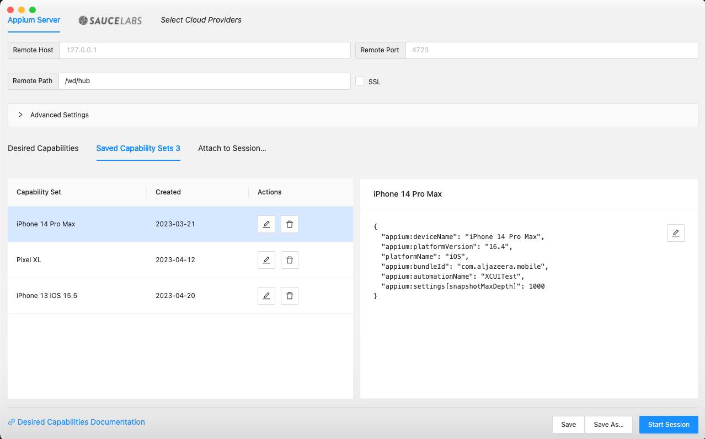
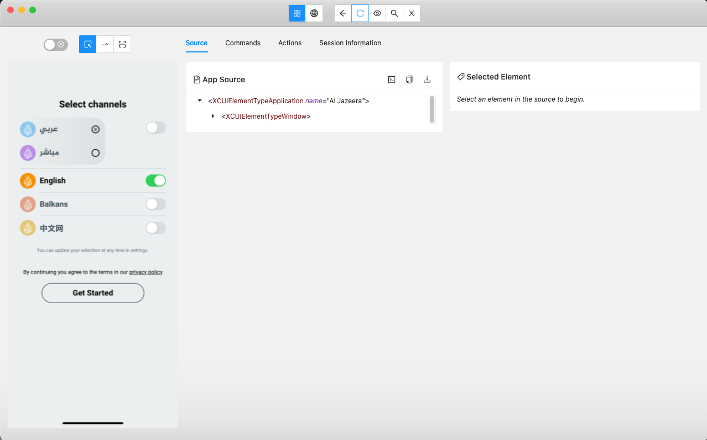
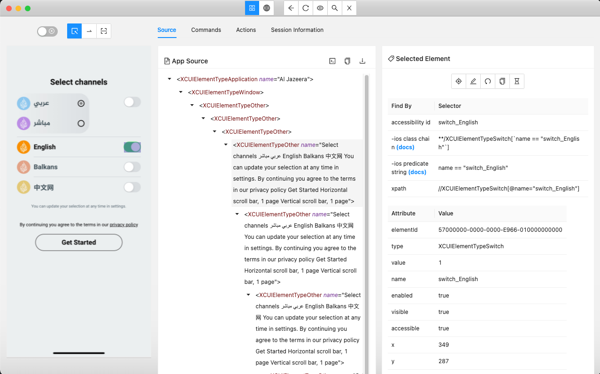

# Setting up end-to-end automation for iOS and Android

## Table of content

- [About WebDriverIO](#about-webdriverio)
- [About Appium](#about-appium)
- [Prerequisites](#prerequisites)
- [Setup Appium](#setup-appium)
- [Setup WebDriverIO](#setup-webdriverio)
  - [Android](#android)
  - [iOS](#ios)
- [Environment Variables](#environment-variables)
- [Running the end-to-end](#running-the-end-to-end-tests)
  - [Locally](#locally)
  - [Remotely via Sauce Labs](#remotely-via-sauce-labs)
  - [Running specific tests](#running-specific-tests)
- [Appium Inspector Guide](#appium-inspector-guide)
  - [Prerequisites](#prerequisites-1)
  - [How to use Appium Inspector](#how-to-use-appium-inspector)
- [Troubleshooting](#troubleshooting)
  - [Activity name used to start the app doesn't exist or cannot be launched!](#activity-name-used-to-start-the-app-doesnt-exist-or-cannot-be-launched)
  - [const stringWidth = require('string-width');](#const-stringwidth--requirestring-width)

## About WebDriverIO

WebDriverIO is a popular open-source testing framework that allows you to automate web applications with ease. It provides a wide range of APIs and integrations with other tools, making it a powerful choice for UI and API testing.

## About Appium

Appium is an open-source mobile app automation tool, which allows you to automate tests for native, web, and hybrid mobile apps on iOS and Android devices. Appium 2.0 is the latest version of Appium, and it offers new features and improvements to make it easier to use and more powerful. To know more about [Appium](https://appium.io/), check out the official documentation.

## Prerequisites

Before you begin, make sure you have the following installed:

- Node.js (version 14 or later)
- Xcode
- Android Studio
- Appium
- Appium Inspector

## Setup Appium

1. To install the Appium 2 server using Node Package Manager (npm) run the following command:

```bash
npm install -g appium@next
```

2. Once the installation is complete, install the UiAutomator2 driver by using the following command:

```bash
appium driver update uiautomator2
```

3. Now, install the XCUITests driver by using the following command:

```bash
appium driver install xcuitest       
```

4. Install the appium-doctor package by running the following command:

```bash
npm install -g appium-doctor
```

5. Run the appium-doctor command to verify that all the dependencies are installed correctly and that your system is set up correctly to run Appium:

```bash
appium-doctor
```

> :bangbang: If there are any issues, follow the instructions provided by appium-doctor to resolve them.

6. Install the Appium Inspector UI by downloading and installing the .dmg or .exe file from the [Appium Inspector releases page](https://github.com/appium/appium-inspector/releases).

7. Launch the Appium server by running the following command:

```bash
appium --base-path=/wd/hub --log-level debug
```

That's it! You should now be able to install and set up Appium 2.0 to run tests with iOS and Android drivers.

## Setup WebDriverIO 

Appium needs to know the package and activity names (in case of the application running in debug mode) or the app file to properly initialize the application under test. This information is expected to be provided in driver capabilities.

### Android

To set Appium capabilities for Android in WebDriver.IO, you can use the `./config/wdio.android.conf.ts` file to configure the capabilities. Here's an example of how you can set the capabilities:

```typescript
...
config.capabilities = [
  {
    maxInstances: 1,
    platformName: 'Android',
    'appium:app':
      '<APK_FILE_PATH>',
    'appium:deviceName': '<DEVICE_NAME>',
    'appium:platformVersion': '<PLATFORM_VERSION>',
    'appium:orientation': 'PORTRAIT',
    'appium:automationName': 'UiAutomator2',
    'appium:appPackage': 'com.aljazeera.mobile',
    'appium:appActivity': 'MainActivity',
    'appium:appWaitActivity': 'MainActivity',
  },
];
...
```

Update the capabilities by replacing the values within the `< >` brackets in the **capabilities**.

| Capability | Description |
| --- | --- |
| `DEVICE_NAME` |The desired name or identifier of the target device to run the test on. This can refer to a physical device connected to the system or a virtual emulator instance. |
| `PLATFORM_VERSION` | The version of the operating system on the target device. This can be used to ensure the test is running on a compatible OS version. |
| `APK_FILE_PATH` | The path or URL to the APK file that contains the app to be tested. This is used to install the target application onto the device emulator for testing. |

### iOS

To set Appium capabilities for iOS in CodeceptJS, you can use the `./config/wdio.ios.conf.ts` file to configure the capabilities. Here's an example of how you can set the capabilities:

```typescript
...
config.capabilities = [
  {
    maxInstances: 1,
    platformName: 'iOS',
    'appium:app':
      '<APP_FILE_PATH>',
    'appium:deviceName': '<DEVICE_NAME>',
    'appium:platformVersion': '<PLATFORM_VERSION>',
    'appium:orientation': 'PORTRAIT',
    'appium:automationName': 'XCUITest',
    'appium:bundleId': 'com.aljazeera.mobile',
    'appium:autoAcceptAlerts': true,
  },
];
...
```

Update the capabilities replacing the values within the `< >` brackets in the **desiredCapabilities**.

| Capability | Description |
| --- | --- |
| `DEVICE_NAME` |The desired name or identifier of the target device to run the test on. This can refer to a physical device connected to the system or a virtual emulator instance. |
| `PLATFORM_VERSION` | The version of the operating system on the target device. This can be used to ensure the test is running on a compatible OS version. |
| `APP_FILE_PATH` | The path or URL to the APP path that contains the app to be tested. This is used to install the target application onto the device emulator for testing. |

## Environment Variables

To set environment variables in a .env file, follow these steps:
- Inside the .env file, add your environment variables for the following variables:
  - `RP_ACCESS_TOKEN`: your ReportPortal personal access token
  - `SAUCE_USERNAME`: your Sauce Labs username
  - `SAUCE_ACCESS_KEY`: your Sauce Labs access key
  - `REMOTE_IOS_APP_FILE_ID`: the Sauce Labs iOS app id
  - `REMOTE_ANDROID_APP_FILE_ID`: the Sauce Labs Android app id

## Running the end-to-end tests

### Locally

To run the end-to-end test automation for iOS and Android, you can use the following commands:

```bash
yarn run ios:local:test  
```

or 

```bash
yarn run android:local:test  
```

Before running the tests, make sure that the capabilities are set correctly for the device or emulator you want to use for testing. You can modify the desired capabilities in the test files located in the `./config/wdio.android.conf.ts` or `./config/wdio.ios.conf.ts`.

### Remotely via Sauce Labs

To run the tests remotely via Sauce Labs, you need to update all the information about the device capabilities (if the default configuration does not fit with your need) and Sauce Labs credentials (mentioned in [Setting Environment Variables](#setting-environment-variables) section) in the .env file. After that, to run the end-to-end test automation, you can use the following commands

```bash
yarn run ios:remote:test 
```

or


```bash
yarn run android:remote:test 
```

Once the tests are complete, you can view the test results in the console output. The test results will indicate whether the tests have passed, failed, or encountered any errors.

By running end-to-end tests for iOS and Android, you can ensure that your app functions correctly on both platforms and that the user experience remains consistent. End-to-end testing provides a valuable step toward ensuring the quality and reliability of your app.

### Running specific tests

To run the tests, you can use the tags argument to specify which tests to run based on their tags. For example, to run tests with the @regression tag (just including the `@regression` in the test description (in the end of the *describe* or *it* text)), you can use the following command:

```typescript
import NotificationScreen from '../screens/notification.screen';
import SetupScreen from '../screens/setup.screen';
import HomeScreen from '../screens/home.screen';
import Gestures from '../../helpers/gestures.helper';

describe('Home screen @in-progress', () => {
  before(async () => {
    await SetupScreen.header.waitForDisplayed();
    SetupScreen.getStartedBtn.click();
    await NotificationScreen.header.waitForDisplayed();
    NotificationScreen.notificationNoThanksBtn.click();
    await HomeScreen.headerLogo.waitForDisplayed();
  });

  it('should display the latest stories @smoke', async () => {
    await HomeScreen.topStoriesLabel.waitForDisplayed();
    await Gestures.swipeUntilElementPresent(
      await HomeScreen.latestStoriesLabel,
      5,
    );
    expect(await HomeScreen.latestStoriesLabel).toBeExisting();
  });
});
```

```bash
yarn run ios:local:test --mochaOpts.grep=@in-progress
```

To run all the tests inside of the describe

```bash
yarn run ios:local:test --mochaOpts.grep=@smoke 
```

To run only the tests with smoke tag

You can also specify the path to a specific test file using the spec argument. For example, to run tests in the notification.spec.js file, you can use the following command:

```bash
yarn run ios:local:test --spec ./tests/specs/notification.spec.ts           
```

## Appium Inspector Guide

Appium Inspector is a graphical user interface tool for Appium that allows you to visually inspect and interact with the elements in your mobile app. In this guide, we will go through the steps required to set up and use Appium Inspector.

### Prerequisites

- Appium must be installed on your local system
- The app you want to inspect must be installed on a device or emulator
- Device or emulator should be connected to the local system
- Appium server must be started before to using the Inspector tool

### How to use Appium Inspector

- Open the Appium Inspector application.
- Fill in the desired capabilities in the "Desired Capabilities" section. This section contains information such as device name, platform name, app package name, app activity, etc. 
  - Here's an example of a desired capabilities setup for an Android app:

```json
{
  "appium:deviceName": "Pixel 6 Pro",
  "appium:platformVersion": "12",
  "platformName": "Android",
  "appium:bundleId": "com.aljazeera.mobile",
  "appium:automationName": "UiAutomator2",
  "appium:appActivity": "MainActivity",
}
```

  - Here's an example of a desired capabilities setup for an iOS app:

```json
{
  "appium:deviceName": "iPhone 14 Pro Max",
  "appium:platformVersion": "16.2",
  "platformName": "iOS",
  "appium:bundleId": "com.aljazeera.mobile",
  "appium:automationName": "XCUITest",
  "appium:settings[snapshotMaxDepth]": 1000
}
```

- Click on the "Start Session" button to start the session.



- The app will launch on the selected device or emulator and Appium Inspector will display the app elements.



- Use the Inspector tool to interact with the app elements.



- You can view the properties of a specific element by clicking on it in the Inspector tool window.
- Use the various tools and buttons in the Inspector tool window to inspect and modify different aspects of the app's elements.
- Once you have finished using the Inspector tool, you may end the session by clicking on the "Stop Session" button.

## Troubleshooting

This section will be regularly updated with known issues, their solutions, and any recent updates or changes. If you're having problems or running into errors, feel free to check this section or reach out for assistance.

### Activity name used to start the app doesn't exist or cannot be launched!

Currently, the test execution is facing the error `Original error: Activity name '.MainActivity' used to start the app doesn't exist or cannot be launched!` due to the Android version 13. Our suggestion is to downgrade the emulator version to another one.

Full log of the error:

```bash
Error: Can't connect to WebDriver.
Error: Failed to create session.
An unknown server-side error occurred while processing the command. Original error: Cannot start the 'com.aljazeera.mobile' application. Consider checking the driver's troubleshooting documentation. Original error: Cannot start the 'com.aljazeera.mobile' application. Consider checking the driver's troubleshooting documentation. Original error: Activity name '.MainActivity' used to start the app doesn't exist or cannot be launched! Make sure it exists and is a launchable activity
```

**Note:** We are currently investigating this issue and will provide updates as they become available.

### const stringWidth = require('string-width');

If you encounter the following error running the tests:

```
 ~/Developer/ump/projects/mobile/__tests__/e2e > yarn run ios:local:test                                                                                                                     INT ✘ │ 2.7.7  
yarn run v1.22.19
$ wdio run ./config/wdio.ios.conf.ts
/Users/hugo/Developer/ump/projects/mobile/__tests__/e2e/node_modules/wrap-ansi/index.js:2
const stringWidth = require('string-width');
                    ^

Error [ERR_REQUIRE_ESM]: require() of ES Module /Users/hugo/Developer/ump/projects/mobile/__tests__/e2e/node_modules/string-width/index.js from /Users/hugo/Developer/ump/projects/mobile/__tests__/e2e/node_modules/wrap-ansi/index.js not supported.
Instead change the require of /Users/hugo/Developer/ump/projects/mobile/__tests__/e2e/node_modules/string-width/index.js in /Users/hugo/Developer/ump/projects/mobile/__tests__/e2e/node_modules/wrap-ansi/index.js to a dynamic import() which is available in all CommonJS modules.
    at Object.<anonymous> (/Users/hugo/Developer/ump/projects/mobile/__tests__/e2e/node_modules/wrap-ansi/index.js:2:21)
    at async Promise.all (index 0)
    at async file:///Users/hugo/Developer/ump/projects/mobile/__tests__/e2e/node_modules/@wdio/cli/bin/wdio.js:15:17 {
  code: 'ERR_REQUIRE_ESM'
}
error Command failed with exit code 1.
info Visit https://yarnpkg.com/en/docs/cli/run for documentation about this command.
```

This is caused by an incompatibility issue between the version of WebDriverIO you are using and the string-width package. To resolve this issue, follow these steps:

Remove the **node_modules** folder and **yarn.lock** file from your project directory.
Run the following command to reinstall the dependencies:

```bash
yarn install
```

This will ensure that you have the latest version of WebDriverIO and its dependencies installed.

Try running your tests again. The error should now be resolved.
If you continue to encounter this error after following these steps, please check your code for any other issues that may be causing the problem.